<div align="center">

# github-readme-cat

**GitHub 프로필 README 위를 걸어 다니는 픽셀 고양이.**
코딩을 많이 할수록 더 빨리 걸어요.

<picture>
  <source media="(prefers-color-scheme: dark)" srcset="./examples/cat-dark.svg">
  
</picture>

[English](./README.md) | 한국어

</div>

## 특징

- 🐾 **진짜 고양이 걸음걸이**: 같은 쪽 뒷다리 → 앞다리 순서의 4박자 걸음, 흔들리는 꼬리, 깜빡이는 눈
- 🎨 **내 고양이 만들기**: 준비된 고양이 8종, 또는 털색·무늬·눈 색(오드아이도 가능)·접힌 귀·짧은 꼬리·목걸이를 직접 골라요. 최대 3마리가 한 공간에서 함께 움직여요
- 📈 **활동량에 따라 움직임이 달라져요**: 기여 0 → 제자리에서 기다림, 1~9 → 걷기, 10 이상 → 빠르게 걷기
- 🌗 **라이트·다크 테마** 모두 지원
- ⚡ **서버 없음**: GitHub Action이 내 저장소에 SVG 파일을 만들어 두기 때문에 깨질 일이 없어요



## 빠른 시작

1. 내 프로필 저장소(사용자 이름과 같은 이름의 저장소, 예: `octocat/octocat`)를 엽니다.
2. `.github/workflows/readme-cat.yml` 파일을 추가합니다:

```yaml
name: readme-cat

on:
  schedule:
    - cron: "0 0 * * *"   # 매일
  workflow_dispatch:

permissions:
  contents: write

jobs:
  cat:
    runs-on: ubuntu-latest
    steps:
      - uses: actions/checkout@v5
      - uses: subin21cc/github-readme-cat@v1
        with:
          coats: orange        # 예: orange,black,tabby
      - name: Commit
        run: |
          git config user.name github-actions
          git config user.email github-actions@github.com
          git add github-readme-cat
          git commit -m "update readme cat" && git push || echo "no changes"
```

3. **Actions** 탭에서 `Run workflow`로 한 번 실행한 뒤, `README.md`에 아래를 넣습니다:

```html
<a href="https://github.com/subin21cc/github-readme-cat">
<picture>
  <source media="(prefers-color-scheme: dark)" srcset="./github-readme-cat/cat-dark.svg">
  
</picture>
</a>
```

## 옵션

| 입력 | 기본값 | 설명 |
|---|---|---|
| `coats` | `orange` | 쉼표로 구분한 고양이 목록, 최대 3마리. [내 고양이 만들기](#내-고양이-만들기) 참고 |
| `width` | `720` | 모든 고양이가 함께 쓰는 가로 공간의 너비(px). 서 있는 고양이가 겹치지 않도록 한 마리당 224px 이상 필요 |
| `pace` | `1` | 다리 움직임 속도 배수. 그림을 원래 너비보다 작게 보여 줄 때 `1`보다 크게(예: `3`) 하면 다리가 느려짐 |
| `days` | `7` | 최근 며칠간의 기여를 셀지 |
| `username` | 저장소 주인 | 누구의 기여로 고양이를 움직일지 |
| `output_dir` | `github-readme-cat` | `cat-light.svg`, `cat-dark.svg`를 저장할 폴더 |
| `github_token` | `github.token` | 기여 수를 읽을 토큰 |

## 내 고양이 만들기



`coats`의 고양이 하나하나는 프리셋, 옵션, 또는 둘 다로 적습니다. 옵션이 프리셋보다 우선해요:

```yaml
coats: "calico ears=fold collar=red, siamese eyes=blue/amber tail=short, tuxedo collar=#4a90d9"
```

**프리셋:** `orange`(치즈), `black`(검정), `tabby`(고등어), `gray`(회색), `white`(흰색), `tuxedo`(턱시도), `calico`(삼색이), `siamese`(샴)

| 옵션 | 값 | |
|---|---|---|
| `fur` | 색 | 기본 털색 |
| `stripe` | 색 | 줄무늬, 또는 `calico`·`siamese`의 두 번째 색 |
| `belly` | 색 | 가슴·배·발 |
| `eyes` | 색, 또는 `왼쪽/오른쪽` | `eyes=green`, 오드아이: `eyes=blue/amber` |
| `pattern` | `tabby`, `solid`, `tuxedo`, `calico`, `siamese` | 색이 들어가는 무늬 |
| `ears` | `pointed`, `fold` | 쫑긋한 귀 / 접힌 귀 |
| `tail` | `long`, `short` | 긴 꼬리 / 짧은 꼬리 |
| `collar` | 색, `none` | 작은 방울이 달린 목걸이 |

색은 `#rrggbb`, `#rgb` 또는 이름으로 적어요: `black`, `white`, `gray`, `cream`, `brown`, `orange`, `red`, `pink`, `purple`, `blue`, `green`, `yellow`, `amber`, `copper`.

우리 집 고양이처럼 만들고 싶다면 사진에서 색을 뽑아 넣어 보세요:

```yaml
coats: "fur=#c08552 stripe=#7a4a2a belly=cream eyes=green"
```


## 기분

| `days` 동안의 기여 | 상태 |
|---|---|
| 0 | 제자리에 서서 꼬리만 천천히 흔듦 |
| 1~9 | 걷기 |
| 10 이상 | 빠르게 걷기 |



## 로컬에서 실행

Python 3만 있으면 됩니다 (추가 패키지 없음):

```bash
python3 src/cat.py --coats orange,black --contributions 12 --theme dark --out cat.svg
```

## 라이선스

[MIT](./LICENSE). 고양이 그림은 이 프로젝트를 위해 직접 그린 픽셀 아트입니다.
